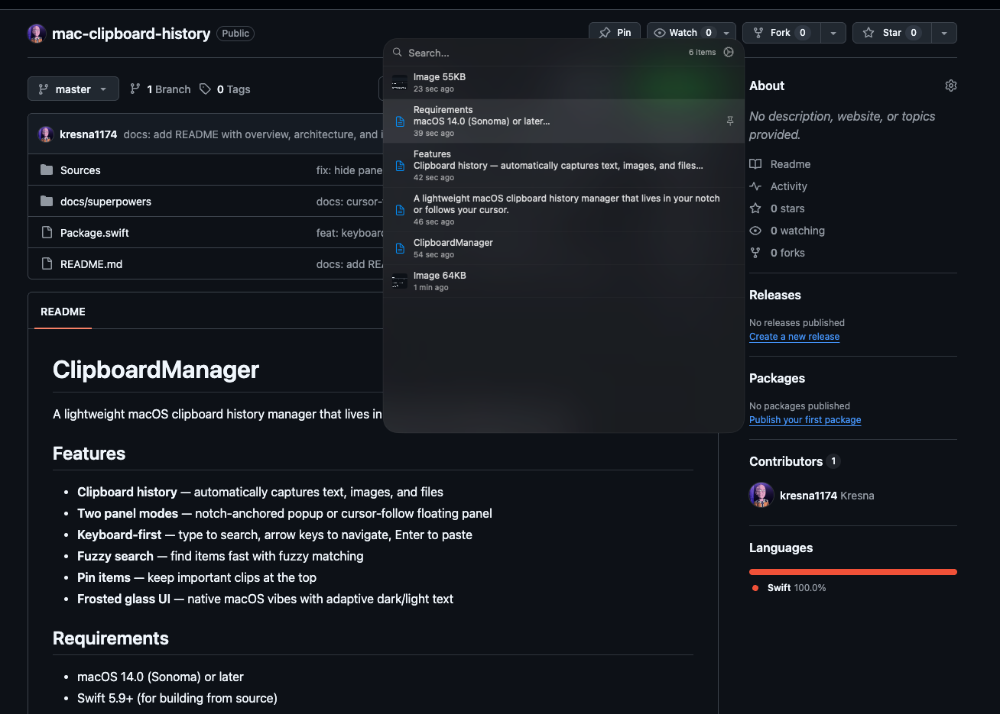

# Clippy

A lightweight macOS clipboard history manager that lives in your notch or follows your cursor.



## Features

- **Clipboard history** — automatically captures text, images, and files
- **Two panel modes** — notch-anchored popup or cursor-follow floating panel
- **Keyboard-first** — type to search, arrow keys to navigate, Enter to paste
- **Fuzzy search** — find items fast with fuzzy matching
- **Pin items** — keep important clips at the top
- **Frosted glass UI** — native macOS vibes with adaptive dark/light text

## Requirements

- macOS 14.0 (Sonoma) or later
- Swift 5.9+ (for building from source)

## Install

```bash
git clone https://github.com/your-username/Clippy
cd Clippy
bash install.sh
```

`install.sh` builds a release binary, creates `Clippy.app` in `/Applications`, and registers a LaunchAgent so it starts automatically on login.

### Accessibility Permission

For **cursor-follow mode**, grant Accessibility access when prompted, or go to:  
**System Settings → Privacy & Security → Accessibility** → enable Clippy.

## Uninstall

```bash
bash uninstall.sh
```

Stops the app, removes the LaunchAgent, and deletes the app bundle.

## Usage

| Action | How |
|--------|-----|
| Open clipboard | `⌘⇧V` |
| Search | Type immediately after opening |
| Navigate | `↑` / `↓` arrow keys |
| Paste selected | `Enter` |
| Copy only (no paste) | `⌘Enter` |
| Click to paste | Click any item |
| Pin / unpin | Hover item → click pin icon |
| Dismiss | `ESC` or click outside |
| Settings | Gear icon in panel header |

## Panel Modes

**Notch** (default) — panel drops from the MacBook notch at the top of the screen.

**Follow cursor** — panel appears near your text cursor (or mouse position if caret is not detectable). Switch in Settings → Panel Position. Requires Accessibility permission.

## Architecture

```
Sources/
├── App/
│   ├── AppDelegate.swift          # App entry point, wires everything together
│   ├── AppPreferences.swift       # UserDefaults-backed settings (PanelMode)
│   └── Info.plist
├── Keyboard/
│   └── HotkeyManager.swift        # Global ⌘⇧V hotkey registration
├── Monitor/
│   └── ClipboardMonitor.swift     # Polls NSPasteboard for new items
├── Storage/
│   ├── ClipboardItem.swift        # Data model (text / image / file)
│   └── ClipboardStore.swift       # SQLite store via GRDB, size-limited
└── UI/
    ├── Components/
    │   ├── ClipboardItemRow.swift  # Single row with hover + selection highlight
    │   ├── FuzzySearcher.swift     # Fuse-powered fuzzy search
    │   └── VisualEffectBlur.swift  # NSVisualEffectView wrapper
    ├── MenuBar/
    │   └── MenuBarController.swift # Menu bar icon + secondary toggle
    ├── NotchPanel/
    │   ├── NotchPanelContent.swift # Shared SwiftUI panel view + keyboard nav
    │   ├── NotchPanelController.swift  # Notch-mode lifecycle (animate expand/collapse)
    │   └── NotchWindow.swift       # Borderless NSWindow anchored to notch
    ├── Panel/
    │   ├── FloatingPanelController.swift  # Cursor-follow lifecycle + AX caret detection
    │   ├── FloatingPanelWindow.swift      # Borderless NSWindow at .popUpMenu level
    │   └── PanelCoordinator.swift         # Routes toggle() to correct controller by mode
    └── Settings/
        └── SettingsView.swift      # Storage limit, panel mode, launch at login
```

**Data flow:**
1. `ClipboardMonitor` detects pasteboard change → `ClipboardStore` persists item (SQLite, GRDB)
2. `HotkeyManager` fires `⌘⇧V` → `PanelCoordinator.toggle()`
3. Coordinator checks `AppPreferences.panelMode` → delegates to `NotchPanelController` or `FloatingPanelController`
4. Controller spawns window with `NotchPanelContent` (shared SwiftUI view)
5. User selects item → item written to `NSPasteboard` → optional `⌘V` CGEvent posted to previous app

## Dependencies

| Package | Purpose |
|---------|---------|
| [GRDB](https://github.com/groue/GRDB.swift) | SQLite ORM for clipboard storage |
| [HotKey](https://github.com/soffes/HotKey) | Global keyboard shortcut registration |
| [Fuse](https://github.com/krisk/fuse-swift) | Fuzzy search |

## Building from Source

```bash
swift build            # debug
swift build -c release # release
swift run              # run debug build directly
```
